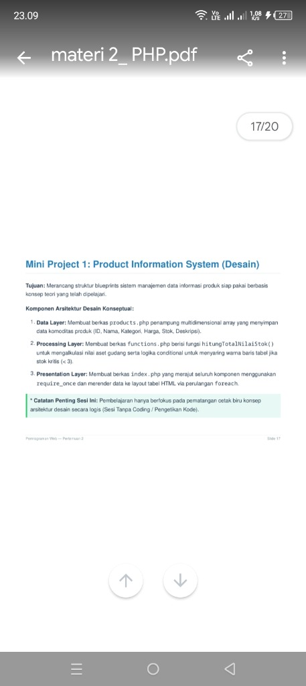

# Product Information System - Mini Project PHP



> **Mini Project 1: Product Information System** adalah aplikasi berbasis web menggunakan PHP Native yang dibangun dengan pendekatan **Arsitektur Desain Konseptual 3-Tier** (Data Layer, Processing Layer, dan Presentation Layer).

---

## 📌 Fitur Utama

- 📊 **Monitoring Data Produk**: Menampilkan daftar produk lengkap dengan ID, Nama, Kategori, Harga, Stok, dan Deskripsi.
- 💰 **Kalkulasi Otomatis Nilai Aset**: Menghitung total nilai aset gudang berdasarkan perkalian harga dan stok secara real-time (`harga * stok`).
- ⚠️ **Deteksi Stok Kritis (< 3)**: Menyoroti (*highlight*) baris tabel dengan warna khusus dan memberikan badge peringatan otomatis untuk produk dengan jumlah stok di bawah 3 unit.
- 🎨 **Tampilan Responsive & Modern**: Menggunakan Bootstrap 5 dan Font Awesome untuk antarmuka pengguna yang bersih dan informatif.

---

## 🏗️ Struktur Arsitektur Sistem (3-Tier Concept)

Project ini memisahkan tanggung jawab kode menjadi 3 berkas terpisah:

```text
Mini_project_diah/
├── assets/
│   └── app-preview.png     # Foto screenshot tampilan program
├── products.php            # 1. Data Layer (Multidimensional Array)
├── functions.php           # 2. Processing Layer (Fungsi Logika & Kalkulasi)
├── index.php               # 3. Presentation Layer (Layout HTML & Perulangan Foreach)
├── .gitignore              # Penyaringan berkas Git
└── README.md               # Dokumentasi Project & Panduan GitHub
```

### 1. Data Layer (`products.php`)
Bertindak sebagai sumber data (*mock database*). Menampung `multidimensional array` yang menyimpan seluruh atribut komoditas produk (ID, Nama, Kategori, Harga, Stok, Deskripsi).

### 2. Processing Layer (`functions.php`)
Berisi kumpulan fungsi pemrosesan logika bisnis:
- `hitungTotalNilaiStok(array $products)`: Menghitung total akumulasi nilai aset gudang.
- `isStokKritis(int $stok)`: Memeriksa apakah stok berada di bawah batas aman (`< 3`).
- `getRowStyleClass(int $stok)`: Memberikan class CSS penanda baris tabel untuk stok kritis.
- `formatRupiah(float $angka)`: Memformat nominal angka ke format mata uang Rupiah.

### 3. Presentation Layer (`index.php`)
Merajut seluruh komponen menggunakan `require_once` dan merender data ke layout tabel HTML interaktif menggunakan perulangan `foreach`.

---

## 📸 Petunjuk Penataan Foto Screenshot (`assets/`)

Untuk menampilkan foto screenshot tampilan program Anda sendiri di dalam file `README.md` ini, ikuti langkah berikut:

1. Ambil screenshot (*tangkap layar*) aplikasi yang berjalan di browser Anda.
2. Simpan atau rename file foto tersebut menjadi: **`app-preview.png`** (atau `app-preview.jpg`).
3. Pindahkan file foto tersebut ke dalam folder **`assets/`** di direktori project:
   ```text
   assets/app-preview.png
   ```
4. Gambar di bagian atas `README.md` akan otomatis memperbarui tampilan screenshot aplikasi Anda.

---

## 🚀 Cara Menjalankan Project (Lokal)

### Menggunakan PHP Built-in Server (Rekomendasi / Praktis)
1. Buka Terminal / PowerShell / Command Prompt di folder project ini.
2. Jalankan perintah berikut:
   ```bash
   php -S localhost:8000
   ```
   *(Jika menggunakan XAMPP di Windows dan perintah `php` belum masuk PATH system:)*
   ```powershell
   C:\xampp\php\php.exe -S localhost:8000
   ```
3. Buka browser dan akses alamat: `http://localhost:8000`

### Menggunakan XAMPP (htdocs)
1. Salin/Pindahkan folder `Mini_project_diah` ke dalam folder `C:\xampp\htdocs\`.
2. Pastikan service Apache di XAMPP Control Panel sudah dalam posisi **Start**.
3. Buka browser dan akses: `http://localhost/Mini_project_diah/`

---

## 🐙 Panduan Lengkap Upload ke GitHub (Repository)

Berikut adalah langkah-langkah perintah Terminal untuk memasukkan project ini ke repository GitHub Anda:

### 1. Inisialisasi Git Lokal
Buka terminal di folder project, lalu jalankan:
```bash
git init
```

### 2. Tambahkan Semua Berkas ke Staging Area
```bash
git add .
```

### 3. Buat Commit Pertama
```bash
git commit -m "feat: initial commit product information system 3-tier php project"
```

### 4. Ubah Nama Branch Utama ke `main`
```bash
git branch -M main
```

### 5. Hubungkan ke Repository GitHub
1. Buat Repository baru di akun [GitHub](https://github.com/new) Anda (misal nama repo: `Mini_project_diah`).
2. Salin URL repository GitHub Anda (contoh: `https://github.com/username/Mini_project_diah.git`).
3. Jalankan perintah berikut di terminal:
```bash
git remote add origin https://github.com/USERNAME_ANDA/Mini_project_diah.git
```
*(Ganti `USERNAME_ANDA` dengan username GitHub Anda).*

### 6. Push Project ke GitHub
```bash
git push -u origin main
```

---
*Dibuat untuk memenuhi tugas Mini Project 1: Product Information System (Desain & Implementasi).*
